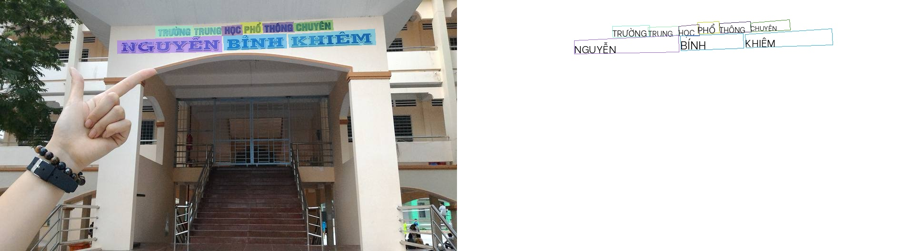

# Optical Character Recognition (OCR) - Overview
OCR is a key field in computer vision. One typical scenario is the recognition of structured texts of particular areas, which is widely used in daily life, such as license plate recognition, bank card information recognition, ID card information recognition, train ticket information recognition, and so on.

## Challenges in OCR
- Perspective transformation
- Large scale change
- Curve text
- Background noise
- Difference fonts
- Muti-languages
- Image blur
- Illumination

## The two main method in OCR problems:
- Location text regions in image then recognize the text content: using two models, one for text detect and one for text recognize.
- End-to-end text recognition: only one model for text detect and text recognize.

## Text detection
Some popular text detection algorithms can be roughly divided into two categories:
- Regression-based Algorithms: `CTPN`, `SegLink`, `East`, `Textboxes/Textboxes++`, ...
- Segmentation-based Algorithms: `SPCNet`, `PSENet`, `PAN`, `DB`, ...
## Text Recognition
- Text recognition can generally be divided into two categories:
Regular Text Recognition (printed fonts, scanned text, which is roughly horizontal): `CTC-based` algorithm, `Sequence2Sequence-based` algorithm, ...
- Irregular Text Recognition (not in a horizontal position, and often curved, covered, and blurred): `STAR-Net`, `Attention-based` methods like `RARE`, ...

## Further
As OCR technology continues to prosper and the demand for structured information extraction is growing, various technologies concerning intelligent document analysis, like layout analysis, table recognition, and key information extraction, have gained increasing attention.

# PaddleOCR - Vietnamese

## Introduction
PaddleOCR aims to create multilingual, awesome, leading, and practical OCR tools that help users train better models and apply them into practice.

## Install [Paddlepaddle-gpu](https://www.paddlepaddle.org.cn/en/install/quick?docurl=/documentation/docs/en/install/pip/windows-pip_en.html)
- Linux + Cuda11.2
    ```
    python -m pip install paddlepaddle-gpu==2.3.1.post112 -f https://www.paddlepaddle.org.cn/whl/linux/mkl/avx/stable.html
    ```
- Window + Cuda11.2
    ```
    python -m pip install paddlepaddle-gpu==2.3.1.post112 -f https://www.paddlepaddle.org.cn/whl/windows/mkl/avx/stable.html
    ```

## Install  PaddleOCR-Vietnamese

```
git clone https://github.com/minhhoai1001/ppocr-vietnamese.git
pip install -r requirements.txt
```

## Prepare dataset
- Download VinText: [Dictionary-guided Scene Text Recognition](https://github.com/VinAIResearch/dict-guided) and save at train_data
- Unzip file `vietnamese_original.zip`
    ```
    cd train_data
    unzip vietnamese_original.zip
    ```
- Format: `x1, y1, x2, y2, x3, y3, x4, y4, TRANSCRIPT`

## Training detection text
- Document: [SAST](https://github.com/PaddlePaddle/PaddleOCR/blob/release/2.6/doc/doc_en/algorithm_det_sast_en.md)
- Download pretrain: [det_r50_vd_sast_icdar15_v2.0_train](https://paddleocr.bj.bcebos.com/dygraph_v2.0/en/det_r50_vd_sast_icdar15_v2.0_train.tar) to pretrain_models\

    ```
    wget https://paddleocr.bj.bcebos.com/dygraph_v2.0/en/det_r50_vd_sast_icdar15_v2.0_train.tar
    # unzip det_r50_vd_sast_icdar15_v2.0_train.tar
    tar -xvf det_r50_vd_sast_icdar15_v2.0_train.tar
    ```
- Prepare data for training: Convert to paddleocr format
    ```
    python convert2paddleorc.py --path train_data/vietnamese/
    ```
- Folder after convert
    ```
    ├── train_data
    │   └── vietnamese
            ├── crop_label.txt
            ├── general_dict.txt
            ├── img_crop
            ├── labels
            ├── test_image
            ├── test_label.txt
            ├── train_images
            ├── train_label.txt
            ├── unseen_test_images
            ├── useen_label.txt
            └── vn_dictionary.txt
        
    ```
- Configs training parameter: `configs/det/det_r50_sast_vn.yml`
    ```
    epoch_num: 300
    save_model_dir: ./output/r50_sast_vn/
    pretrained_model: ./pretrain_models/det_r50_vd_sast_icdar15_v2.0_train/best_accuracy

    Train:
        data_dir: ./train_data/vietnamese/train_images
        label_file_list: [ ./train_data/vietnamese/train_label.txt ]

    Eval:
        data_dir: ./train_data/vietnamese/test_images
        label_file_list:
        - ./train_data/vietnamese/test_label.txt
    ```
- Training:
    ```
    python tools/train.py -c ./configs/det/det_r50_sast_vn.yml
    ```
- Training from checkpoint
    ```
    python tools/train.py \
        -c ./configs/det/det_r50_sast_vn.yml \
        -o Global.checkpoints=./output/r50_sast_vn/iter_epoch_{epoch}
    ```

- Export the model training process into an inference model
    ```
    python tools/export_model.py \
        -c configs/det/det_r50_sast_vn.yml \
        -o Global.pretrained_model=./output/det_r50_sast_vn/latest  \
        Global.save_inference_dir=./inference/det_r50_sast_vn
    ```

- Inference
    ```
    python tools/infer/predict_det.py \
        --det_algorithm="SAST" \
        --image_dir="./train_data/vietnamese/test_image/im1500.jpg" \
        --det_model_dir="./inference/det_r50_sast_vn/"
    ```

## Training Recognition text
- Document: [PP-OCRv3](https://github.com/PaddlePaddle/PaddleOCR/blob/release/2.6/doc/doc_en/PP-OCRv3_introduction_en.md)
- Download pretrain: `en_PP-OCRv3_rec_train`
    ```
    wget https://paddleocr.bj.bcebos.com/PP-OCRv3/english/en_PP-OCRv3_rec_train.tar
    tar xf en_PP-OCRv3_rec_infer.tar
    ```
- Prepare data for training: crop each word to each image and txt file follow format;
    ```
    python crop_image.py --path train_data/vietnamese/
    ```
- Configs training parameter: `configs/rec/PP-OCRv3/vn_PP-OCRv3_rec.yml`
    ```
    epoch_num: 100
    save_model_dir: ./output/rec_v3_vn_mobile
    pretrained_model: ./pretrain_models/en_PP-OCRv3_rec_train/best_accuracy
    checkpoints: ./output/rec_v3_vn_mobile/latest
    save_inference_dir: ./inference/rec_ppocr_v3
    character_dict_path: ppocr/utils/dict/vi_vietnam.txt

    Train:
        data_dir: ./train_data/vietnamese/img_crop
        label_file_list:
        - ./train_data/vietnamese/crop_label.txt

    Eval:
        data_dir: ./train_data/vietnamese/img_crop
        label_file_list:
        - ./train_data/vietnamese/crop_label.txt
    ```
- Training:
    ```
    python tools/train.py -c ./configs/rec/PP-OCRv3/vn_PP-OCRv3_rec.yml
    ```
- Training from checkpoint
    ```
    python tools/train.py \
        -c ./configs/rec/PP-OCRv3/vn_PP-OCRv3_rec.yml \
        -o Global.checkpoints=./output/rec_v3_vn_mobile/iter_epoch_{epoch}
    ```
- Export the model training process into an inference model
    ```
    python tools/export_model.py \
        -c rec/PP-OCRv3/vn_PP-OCRv3_rec.yml \
        -o Global.pretrained_model=./output/rec_v3_vn_mobile/latest  \
        Global.save_inference_dir=./inference/rec_ppocr_v3
    ```

- Inference
    ```
    python tools/infer/predict_rec.py \
        --image_dir="./train_data/vietnamese/img_crop/im0001_0.jpg" \
        --rec_model_dir="./inference/rec_ppocr_v3_vn/"  \
        --rec_char_dict_path="ppocr/utils/dict/vi_vietnam.txt"
    ```

## Inference two model together
```
    python tools/infer/predict_system.py \
        --image_dir="./train_data/vietnamese/test_image/im1500.jpg" \
        --det_model_dir="./inference/det_r50_sast_vn/" \
        --det_algorithm="SAST" \
        --rec_image_shape="3, 48, 320" \
        --rec_model_dir="./inference/rec_ppocr_v3_vn/" \
        --rec_char_dict_path="./ppocr/utils/dict/vi_vietnam.txt" \
        --vis_font_path="doc/fonts/vietnam-light.ttf"
```
- Result


